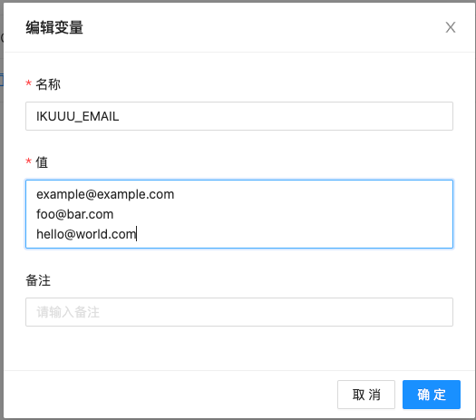
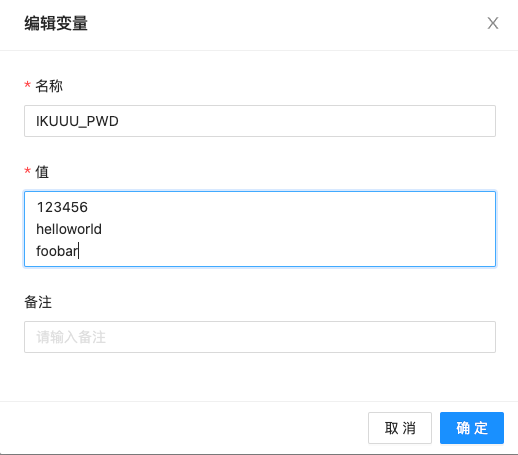
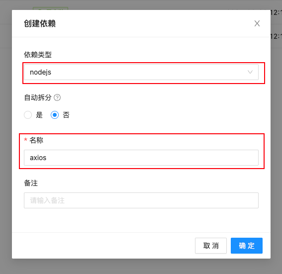
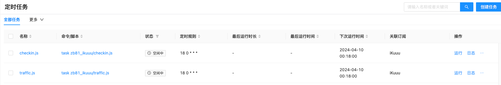
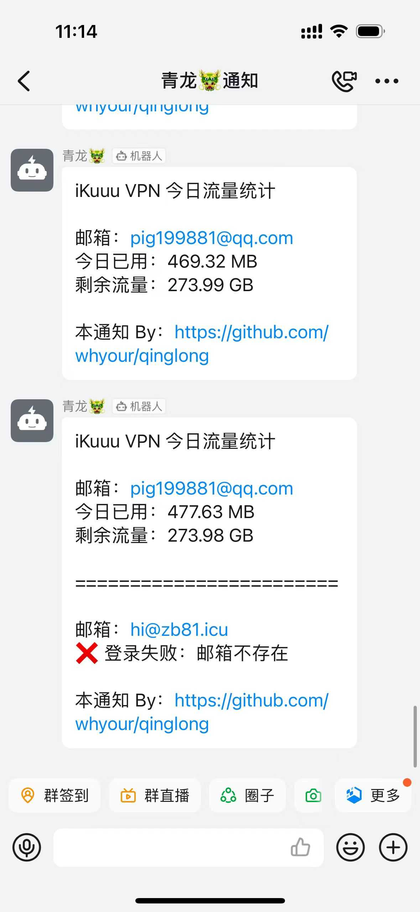

# ql-ikuuu

青龙脚本，iKuuu VPN 签到、获取今日使用流量。

## 如何使用

### 第一步：添加邮箱、密码到环境变量

打开青龙面板，创建 `IKUUU_EMAIL` 和 `IKUUU_PWD` 变量，多个邮箱或密码请换行。

> 注意：邮箱和密码数量必须一致且一一对应。

  

  

### 第二步：添加依赖项

  

### 第三步：添加订阅

```sh
ql repo https://github.com/zb81/ql-ikuuu.git "checkin|traffic" "" "qlApi|utils"
```

添加订阅后在定时任务中执行：

  

## 通知效果

  


## 原理

- 签到：直接发送 POST 请求
- 流量：请求 HTML 字符串，通过正则表达式提取

## 感谢

- mrabit: [aliyundriveDailyCheck](https://github.com/mrabit/aliyundriveDailyCheck)
